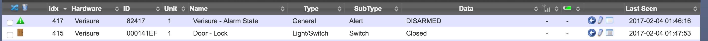
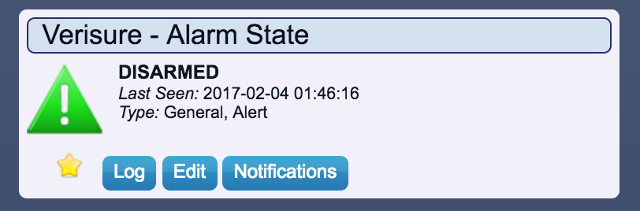
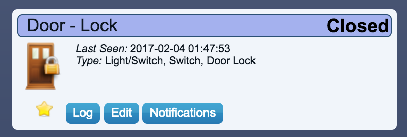

# verisure-inbound
Solution to trigger actions on different incoming emails from Verisure

###Requirements:
- Dokku or Heroku
- Sendgrind account with Inbound E-mail Parsing
- Domoticz with a MQTT connection

###Domoticz
* Create Dummy in Hardware
* Create a Dummy Alarm - f.ex. (Verisure - Alarm State) gets IDX 10
* Create a Dummy Switch - f.ex. (Door - Lock) gets IDX 11

###Sendgrid
* Set up an Inbound Email endpoint that goes to https://URLTOINSTANCE/inbound

###Needed variables in Dokku
    DOMOTICZ_IDX_ARMSTATE:   IDX for Dummy Alarm - 10 in this case
    DOMOTICZ_IDX_DOOR:       IFX for Dummy Switch - 11 in this case
    MQTT_HOST:               IP/HOST to MQTT - No ssl atm
    MQTT_PASSWORD:           Password to MQTT Server
    MQTT_USERNAME:           Username to MQTT Server
    VERISURE_EMAIL:          Verisure Login
    VERISURE_PASSWORD:       Verisure Password

###Screenshots

Inbound mail parsing based on https://github.com/sendgrid/sendgrid-python/tree/master/sendgrid/helpers/inbound
